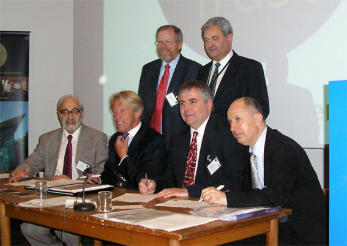

A new BPhO Administrative Office has been established at the University of Oxford. A generous grant from the Ogden Trust and the Institute of Physics has enabled the University to employ a full-time Olympiad Administrator, Miss Lorna Stevenson. She will take care of all administrative aspects of the competition for the next three years, and can be reached on [BPhO@physics.ox.ac.uk](mailto:BPhO@physics.ox.ac.uk), or 01865 282447.

Dr Cyril Isenberg, who for 25 years has been the lynchpin of the BPhO, will continue to have academic oversight for the competitions. However, all enquiries should now be directed towards Miss Stevenson in the first instance.

The photograph below shows the signing of the agreement for Oxford to host the BPhO, which took place at the 4th Ogden Trust Science Forum on 12th June 2008.

Seated from left to right: Dr. Cyril Isenberg (Secretary BPO), Sir Peter Ogden (Ogden Trust), Prof. Robert Taylor (Oxford Physics) and Mr. Philip Diamond (IOP). Back from left to right: Mr. Bill Bryson (Author) and Mr Tim Simmons (Ogden Trust)