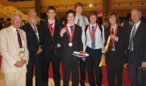

{.fr} An excellent result saw the UK Physics team bring four bronze medals and a honourable mention home from the International Physics Olympiad in Hanoi, Vietnam.

William Kalderon, Harry Desmond, Michael Lipton and Harry Eakins all achieved bronze medals, with Peter Townsend gaining an Honourable Mention. The students joined 400 other young physicists for a ten day trip to Vietnam during 20th - 29th July. The competition interspersed two grueling 5-hour practical and experimental papers with an exciting social and cultural programme that afforded students a flavour of their host country and time meet competitors from around the world.

The IPhO team was once again ably lead by Robin Hughes, Guy Bagnall and Anson Cheung. Observing Teachers, awarded a BPhO scholarship to attend the event, were Adam Patchett of Merchant Taylors' School and Hannah Williams of Oakham School.

For an account of the competition by Harry Eakins, see www.ogdentrust.com/news.37.htm. The picture above shows the students and their leaders at the medal presentation ceremony.