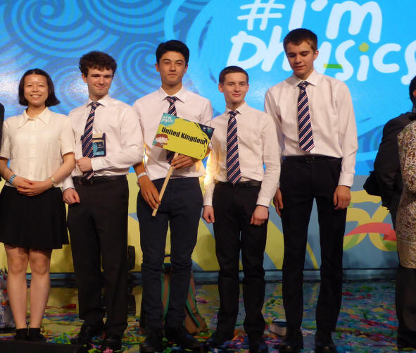
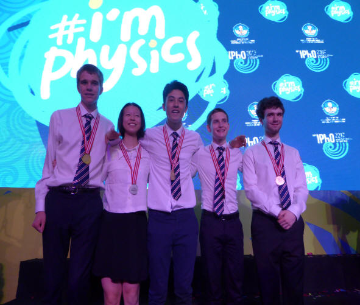

 A rigorous selection programme saw team members Callum Brennan-Rich (The Liverpool Bluecoat School), Robbie King (King’s College School Wimbledon), Weida Liao (Churston Ferrers Grammar School), Euan Tebbutt (Twycross House School), Robert Waddy (Devonport High School for Boys) and reserve James Bayliss (Sutton Grammar School) come together to form the British Physics Olympiad team, travelling to the International Physics Olympiad in Indonesia.

The team gained the following results: **Robbie – Gold, Euan – Gold, Weida – Silver,  Callum – Bronze and Robert – Bronze.**

