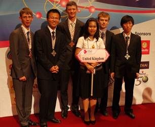

It was a very successful year for the British team at the International Physics Olympiad (IPhO). This year the competition took place in Bangkok, Thailand, with 85 countries from across the world participating.

===

{.fr} It was a very successful year for the British team at the International Physics Olympiad (IPhO). This year the competition took place in Bangkok, Thailand, with 85 countries from across the world participating.

The British team of five were delighted to bring home a full tally of three silver and two bronze medals. Edward Godfrey (Thomas Hardye School, Dorset) was awarded a silver medal and when asked how he felt said “ I enjoyed representing Great Britain. It was a challenge and I was surprised to win a silver medal".

Edward and his team mates, Jiasheng Chen (Abbey College, Cambridge), Samuel Nicholls (Hymers College, Hull), David Ryan (Saint Simon Stock Catholic School, Maidstone) and Yutian Wu (Merchiston Castle School, Edinburgh) were selected from 1700 students from over 300 schools who participated initially in the British Physics Olympiad (BPhO) competition last November. They undertook a number of theoretical papers, practical problems and training camps in the lead up to IPhO to ensure their place on the team.

Students and team leaders dressed in formal wear and national dress for the IPhO opening ceremony attended by Princess Maha Chakri Sirindhorn. The princess congratulated the students on their achievements and hoped that the event would encourage both cultural understanding and collaboration in physics. This was the inspiration for the IPhO 2011 slogan, “Harmony in Physics”.

This year 32 new schools to the BPhO were allocated two free entries by The Ogden Trust. David Ryan was from one such school and his teacher, Jaynarain Hurry, was also invited to the IPhO. Jaynarain felt that it was a “unique learning experience” that allowed “people from different countries and cultures to meet, who have a common passion for physics”.

The competition consisted of two five hour papers; a theoretical exam which this year explored satellite orbits, surface tension and electric dipoles, followed two days later by an experimental exam on, firstly a capacitor array found in digital callipers, and then the compound pendulum. Besides the demanding academic papers, the students also had an opportunity to socialise with other young physicists. They went on a number of excursions where they participated in traditional Thai dance, rode elephants and ate plenty of Thai food. Sam Nicholls turned 18 on the day of the experimental exam and was presented with a card signed by over 25 countries.

Teachers and university academics at the IPhO agreed that the national competitions were useful to stretch and challenge their most able students. In the UK, Jaynarain felt “Paper 2 allowed us to see just how talented and dedicated David was”. He added, “David should be proud of earning recognition as one of the top five physicists for his age in the UK”.

Registration for the BPhO 2012 will begin in September and more information can be found on the website [www.bpho.org.uk](www.bpho.org.uk).
