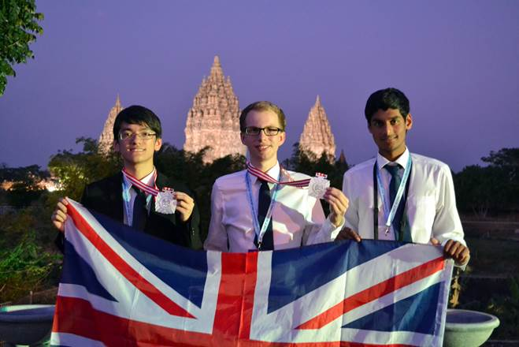
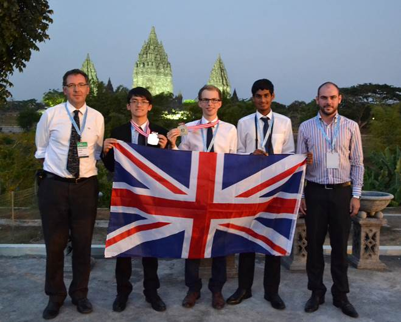

 The Olympiad is an annual international competition for secondary school pupils from around the world, in the fields of Astronomy and Astrophysics. This year was the 9th edition and it was organised in Magelang, Central Java, Indonesia between 26 July and 4 August, with 210 students competing from 41 countries. The UK team led by Sandor Kruk (Merton College, Oxford Astrophysics) and Charles Barclay (Marlborough College) entered the competition for the first time and achieved outstanding results through William McCorkindale (Silver Medal), Bob Cliffe (Silver Medal) and Rizwaan Mohammed. Their performance placed UK 9th in the medal table, out of 41 countries, after three tough rounds: Observations, Theory and Data Analysis. The top three countries were India, Iran and Indonesia. It was a truly impressive event that took Astronomy beyond the boundaries of humanity and culture, with the opening and closing ceremonies held at the majestic temples of Borobudur and Prambanan.

The UK team for the 9th Olympiad on Astronomy and Astrophysics. From left to right, Charles Barclay, William McCorkindale, Bob Cliffe, Rizwaan Mohammed and Sandor Kruk.
